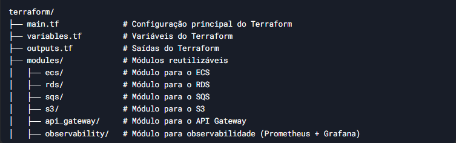

# fluxo-de-caixa-infra
Repositório da infra

# Ex: da infra

## Para rodar local é necessário ter as seguintes ferramentas.

  * Docker: https://docs.docker.com/desktop/setup/install/windows-install/
  
  * Docker Compose: https://docs.docker.com/compose/install/

  * AWS CLI: https://docs.aws.amazon.com/cli/latest/userguide/getting-started-install.html
  
  * AWS LocalStack: https://docs.localstack.cloud/getting-started/installation/
  
  * Terraform: https://developer.hashicorp.com/terraform/tutorials/aws-get-started/install-cli

  * Vs2022: https://visualstudio.microsoft.com/pt-br/downloads

# Projetos complementares para o fluxo de caixa

  * API em .net 8 responsável por fazer os laçamentos de (crédito e debito) / Pesquisar Saldo:  Clique <a href="https://github.com/romymoura/fluxo-de-caixa-lancamento" target="_blank">aqui</a>!

  * Worker .net 8 responsável por consolidar o saldo da loja: Clique <a href="https://github.com/romymoura/fluxo-de-caixa-consolidacao" target="_blank">aqui</a>!
